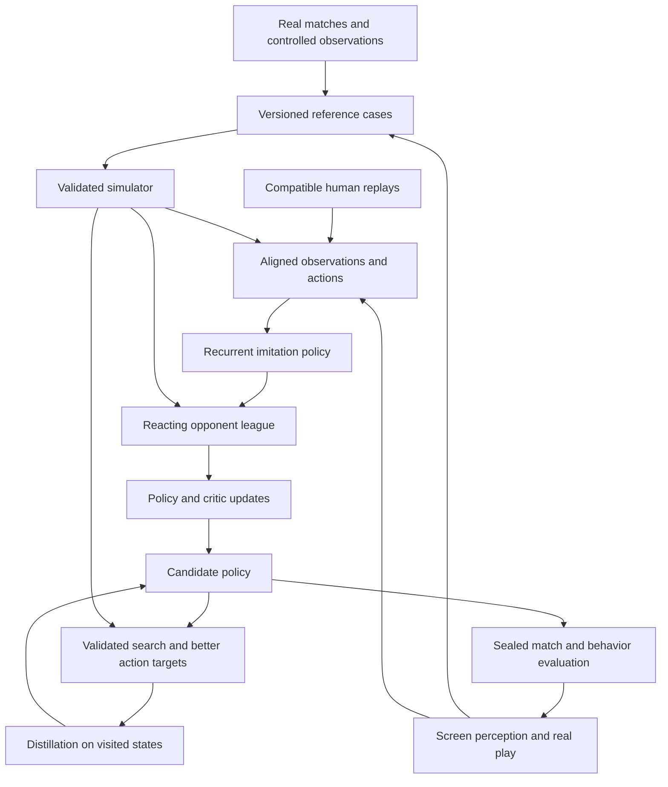

# Clasher pipeline design

The objective is strong human-level Clash Royale play, with a research path toward surpassing the strongest comparable bots. A successful implementation must make good decisions against reacting, competent opponents under a declared game version, information boundary, and control budget. A working automation loop, a simulator win rate, or a good forecast alone does not meet that objective. No current evidence establishes that Clasher meets it.

The chosen direction is a simulator-centered learning system. The September 28 Astra/Fable council approved a fresh public-information entity-attention/LSTM policy, recurrent PPO, and paired scripted-warm-start versus from-scratch experiments. Compatible human supervision is a later measured prior; the existing corpora must first pass a provenance and observation audit. Keep a fast policy-only deployment path. Add teacher search or online search only after its scope and playing benefit are established. The exact approved strategy and endorsements are in `reports/strategy_council_20260928/strategy.md` and `consensus.json`; they supersede conflicting experimental ordering below.

Sam requested maximum reasoning effort for both council models and prioritizes the strongest considered analysis over token savings or latency. Actual engine fidelity, data compatibility, compute throughput, and learning gains remain empirical questions. Routine implementation choices follow the approved strategy; new evidence can justify revisiting its assumptions.

Current execution uses the Mac mini at Sam's request. Grant-account discovery and the remote benchmark are deferred. Local measurements retain the agreed model, with CPU collection using two Torch threads and four to eight environments. Under the current shared machine load, two bounded runs produced 13 completed games at roughly 40–45 learner decisions/second, with unchanged weights. This is collection throughput, not full training throughput. Keep admission checks and sample accounting intact when choosing local batch sizes; the larger compute plan remains a later option.

The simulator fidelity target is transfer of sound Clash play. On September 21 the user clarified that the two-human comparison is a conceptual benchmark, not a request to recruit players or build a multiplayer client. Differences comparable to a small balance change are acceptable if placements, counters, defense, timing, and resource management remain useful for the same reasons. Exact trajectories and identical winners in every close replay are not prerequisites. Prioritize discrepancies that reverse consequential action rankings, systematically break interactions, or create repeatable simulator exploits. Keep residual movement and outcome differences as diagnostics without making every difference a release blocker. A selected-action pass is evidence within its tested candidates and roster, not proof of general transfer. Preserve public-state calibration and counterfactual-ranking gates, and never loosen an already running campaign's frozen criteria after seeing its outcomes. Actual independent human evaluation remains the final playing-strength requirement.

On September 28 the user reinforced the comparison with players adapting to balance updates and mixed card levels. A tower surviving in one simulator replay but falling in the reference is not, by itself, evidence of an ineffective learned strategy. Fixed-command replay can amplify small dynamics differences because its actions cannot respond to the changed board. Distinguish reconstruction failures from systematic decision failures under reacting play. Before basic model competence is demonstrated, prioritize credible core rules, useful action rankings, and adaptation across varied levels and modest dynamics differences over exact interaction breakpoints. Repair clear shared-mechanic bugs when justified, but do not make every close outcome or trajectory mismatch a training prerequisite. Any revised readiness protocol must be prospective; preserve the failed v7 result and its exposure history.

Simulator development is underway in the consolidated checkout at
`/Users/sam/Desktop/code/clasher`. The old training scheduler remains paused.
`HANDOFF_NEW_THREAD_20260928.md` supersedes historical workspace and live-job
status in `HANDOFF.md`; linked native reports preserve the evidence. Public-state calibration and
counterfactual-ranking gates must pass before any policy training or search.
Passing narrow mechanics tests does not satisfy those gates or demonstrate
playing strength.

The arrows from real play back into training apply to designated development data only. Final evaluation recordings remain excluded. Search is conditional on its own validation and is not a prerequisite for the initial imitation baseline.

**Train a shared model across decks, then specialize it for Hog if that remains the deployment choice.** The user explicitly broadened this design on September 13. Professional deck collections provide the main imitation distribution. Procedurally composed decks and random legal decks add interaction coverage and stress tests, with separate sampling and evaluation roles. Both perspectives of compatible expert games can teach card use and defense. Broader training is a hypothesis to measure, not a guarantee that every extra random game improves the specialist.

Simulator validation covers the entire intended card/mechanic scope and follows the clearest available evidence, not a Hog-only filter. Before new expert training, freeze the target patch, forms, card levels, tower troops, match clock, deployment semantics, and enabled roster. Upgrade supported forms through that version contract rather than relabeling evolved or hero examples as base cards. Keep Hog-specific evaluations as one deployment slice of the broader model. Do not defer all other-deck learning until after Hog specialization.

Record the human benchmark before claiming the objective. It needs an identified skill cohort, reacting opponents, comparable levels and decks, full completed matches, seat balance, and measured observation-to-action latency. Use a strong-human milestone first and progressively stronger opponents afterward. The precise cohort and sustained compute budget remain product choices for the next applicable stage. They do not block simulator and data-contract engineering. Do not invent a rating, a cloud allocation, or a completion date to fill those gaps.

| Decision | Default | Reason and condition for revisiting |
|---|---|---|
| Dynamics | Maintain the owned, data-driven simulator | It provides inspectable state, branching, and control; replace a subsystem only when evidence shows repair is less viable than a compatible alternative |
| Native engine | Optional independent reference and data reconstruction backend | Version compatibility and reconstruction must be demonstrated; another project's runtime is not automatically ground truth |
| First learned policy | Supervised recurrent policy using compatible human actions | Avoid asking sparse outcomes to discover all basic placement and timing |
| Improvement baseline | Synchronous recurrent PPO with frozen opponents and history | Establish one understandable update loop before asynchronous throughput work |
| Search | Policy proposals plus sampled opponent responses and hidden-state hypotheses | Clash is simultaneous and partially observed; ordinary perfect-information tree search is insufficient |
| Policy representation | Entity/spatial encoder, current hand pointer, public memory | Reuse existing strengths and preserve exact current hand identity |
| Runtime | Fast actor by default, selective search only after a latency/strength comparison | Offline search can help training even when live search is too expensive |
| Large language model | Research and development assistance | No LLM is required in the per-action gameplay path |
| Learned world model | Deferred | It adds a second dynamics-learning problem before a trustworthy reference exists |
| Compute scaling | Measure complete learner throughput first | Card count, kernel speed, and nominal GPU count do not predict useful games per hour |

**Simulator fidelity has two distinct layers.** The first is correctness of the software implementation: deterministic execution, action handling, terminal rules, exact branching, and agreement between accelerated and reference paths. The second is agreement with the actual game. Keep separate report fields for both. Rename ambiguous report categories in new tooling to `scalar_reference`, `tensor_backend`, and `external_game_reference`. Historical files retain their original names and provenance.

Create a versioned reference-case format before changing physics. Each case records its source, ruleset, initial conditions, submitted and observed action times, positions and coordinate frame, forms/levels, observable entity tracks, damage events, final outcomes, and measurement uncertainty. Separate directly observed fields from reconstructed or inferred fields. A reference generated by our simulator can test internal consistency but cannot certify game fidelity. A reference from a different game build needs an explicit compatibility finding.

Validate interactions in this order: clocks and terminal outcomes; card hand/cycle and elixir; placement legality and deployment delay; movement, river crossing, and collision; target acquisition and retention; first-hit and subsequent attack timing; projectiles and spells; status effects and death spawns; then modern forms and more opponent mechanics. Prioritize cases by frequency in the target task and by whether an error changes the preferred action. This avoids treating every visual difference as equally costly.

The existing Hog/building control is one case family. Expand across ground and air targeting, ranged and melee attacks, area and chained damage, deployment and death spawns, buildings and decay, shields, knockback and forced movement, charge/jump, invisibility, status effects, spells, level scaling, and modern forms. Select cases by evidence quality, mechanic coverage, and decision impact across professional and procedural decks. Vary lane, seat, deployment position, and timing around interaction boundaries. Use paired cases to distinguish one wrong interaction from a whole-match cascade. Do not assume perfect geometric mirror symmetry where the game's tie-breaking is asymmetric.

Fix each demonstrated defect at the shared mechanic or serialized-data layer. Avoid card-name exceptions when a capability or rule explains it. Preserve the failing trace, add a regression that tests the outcome or trajectory contract, fix it, and rerun the affected interaction family. If the accelerated runtime implements that mechanic, update it and compare full states. A speedup that silently falls back does not count as complete accelerated support.

A mechanic is eligible for training once its declared behavioral case family passes, not merely because the code exists. The user's September 13 clarification makes strategically useful fidelity the requirement; universal bit-for-bit parity with the external game is not a prerequisite for training. Costs, damage rules, target eligibility, deployment legality, population/spawn rules, and terminal semantics remain strict. Small differences in swarm trajectories, target choices among nearly equivalent bodies, and timing may be acceptable if bounded tests show they do not systematically teach the wrong decision. Where an interaction outcome is sensitive to a small change, test a neighborhood and its outcome distribution rather than requiring one exact trajectory or assuming the change is harmless.

Keep three separate judgments: internal deterministic correctness, external behavioral fidelity, and transfer of the learned policy. Use exact comparisons to detect unintended changes within a pinned implementation. Set external tolerances prospectively from measurement uncertainty and tactical sensitivity. For video, do not manufacture sub-frame precision. A visibly different Skeleton Army may still be strategically equivalent, but a changed surrounding speed, area-spell survival pattern, or frequency of extra tower hits needs investigation. High winner agreement alone is insufficient; unsupported cases remain visible in coverage reports.

Once the core behavior is validated, train with bounded variations in legal formations, placement timing, and supported physical nuisance parameters, together with realistic observation noise. Separate actual dynamics variation from perception corruption. Fix the variation families and ranges before evaluating on independently held-out variations and real games. Preserve card rules and avoid impossible overlaps or configurations when constructing variants. Randomization is a robustness tool, not a substitute for correcting known systematic errors. Do not delay the first useful policy indefinitely to eliminate harmless floating-point or swarm-trajectory differences.

The simulator API should provide `reset(config, seed)`, deterministic command submission and stepping, public observations by seat, explicit full training state, terminal status, and a versioned snapshot/restore or exact clone. A fork must preserve pending deployments, projectiles, effects, RNG streams, action ordering, entity identity, and all state that changes future behavior. Compare a restored branch with uninterrupted execution over multiple interacting steps, not just a snapshot hash. Replay re-driving is an acceptable initial branch implementation; optimize it only after the policy-improvement workload is measured.

**The actor sees observations and maintains beliefs.** Full world state and actor-visible state are different typed interfaces. The simulator can know hidden hands and resources. The playing actor and any live planner must derive their information from the same observation history that deployment can provide. Keep privileged critic inputs and labels out of actor inputs, masks, caches, auxiliary feedback, and recurrent state.

Represent the board with entities carrying card/form identity, owner, position, observable health/status, and confidence or missingness. Use a spatial representation for buildings, towers, terrain, and placement geometry. Include own hand and next card, own elixir, clock, and public events. Use current hand information directly for card selection so stale recurrent state cannot substitute for the current card slot. Keep entity identities for tracking separate from semantic card identity, and prevent IDs from encoding scenario or outcome labels.

Use an explicit public event tracker for confirmed plays and elapsed time, plus learned recurrent memory for tactical context. Opponent deck/hand and elixir should be possibilities or distributions, not exact hidden labels inserted into the actor. Account for missed events and version-specific cycle mechanics. Do not hardcode a universal four-card cycle when the enabled ruleset changes it. Carry recurrent state across complete games and training segments. Reconstruct chunk state with a prefix or burn-in and test it against uninterrupted inference.

Start from a compact existing entity-attention/LSTM design and a card-conditioned spatial head. Do not retain the accumulated historical repair adapters as defaults in a new model configuration. Use one reviewed core configuration and an explicit checkpoint schema. Increase capacity only when held-out action errors show that the representation or capacity is limiting learning rather than data alignment, training bugs, or missing state.

The initial capacity reference is the existing 128-wide, four-layer actor encoder with 256-wide recurrent memory. These are starting dimensions, not proven optimum values. Reuse the current semantics and test them before changing dimensions. The initial policy cadence is five logic ticks after the target clock is verified, with cadence sensitivity measured before broad training. Entity capacity comes from audited crowded-state coverage; silent truncation is forbidden. Do not add learned placement refinement until the coordinate audit determines its required resolution.

**Actions must include timing and placement precision.** The first decoder chooses wait, play, or an available ability. A play chooses a current hand slot and a position conditioned on that card. Use a causal play-event likelihood over elapsed intervals, with conditional card and placement losses. Retain the simple fixed-cadence categorical wait/play model as the bounded control. Check that a different observation cadence does not unintentionally change the learned play rate. A saved intention to wait for a card may be reconsidered as the board changes; it must not force an uninterruptible wait.

Audit coordinate and action round trips before fitting: screen or replay coordinates to canonical representation, legality, simulator command, and observed execution. Preserve native positions in the dataset. Measure the error from projecting them onto the current whole-tile action space. If that projection changes critical interactions or discards meaningful expert placement detail, introduce finer cells or a constrained residual position head before scaling training. Do not assume a 576-cell output is sufficient for the final skill target. Mask only actions that are impossible under the actor's information and execution contract, not actions deemed strategically bad by a heuristic.

Treat submitted actions, accepted commands, effective deployments, and failed executions as separate events. A classifier trained on accepted commands cannot silently be evaluated as if it predicted screen clicks without latency. Store delays, failed attempts, and uncertainty explicitly. Do not silently replace an illegal action with a tactical fallback during policy evaluation.

For the event model, an initial rate parameterization is `p(play in dt) = 1 - exp(-rate * dt)`, with nonnegative rate and a likelihood that accounts for both events and exposure without an event. The model must be evaluated over entire event streams. A positive-class weight or event resampling scheme cannot be interpreted as an unadjusted natural posterior. Use the same documented sampling or deterministic event decoder throughout a comparison; switching to argmax can change waiting behavior even with identical weights.

**Human data supplies the initial strategy distribution.** Audit compatible public replays and available recordings before selecting a large corpus. The public IL_Replay inventory is promising, but its first inspected shard did not contain an exact vanilla Hog side. That finding is not a corpus-wide estimate. Forms, game version, tower troops, initial card order, action timing, and abilities all affect reconstruction. Inspect valid and failed conversions and retain failure reasons; do not choose only easy-to-reconstruct wins.

A reconstructed state preceding an expert action must match the state in which the human acted. Validate positions, action acceptance, intermediate damage and terminal results. Initial hand ambiguity and timing slack require declared handling. Do not realign each mismatch until the outcome looks plausible. When reconstruction is unreliable, use the observed video state for imitation, or exclude the sequence from that training role with a recorded reason.

Split complete physical matches and their two perspectives together. Keep duplicates and near-duplicate versions together. Prefer independent player and time/patch exclusions where identity and dates are available. Where anonymization removed them, state the weaker guarantee and obtain separate external tests. Development, policy selection, timing/probability calibration, and final acceptance are separate roles. New data roles must not repurpose the already opened old diagnostics.

Balance action opportunities and strategic situations without confusing the sampled training distribution with natural probabilities. Correct the likelihood or weights when resampling changes the target prior. Mask unknown labels rather than making unknown mean zero. Retain alternative valid actions in evaluation; exact human tile agreement is a diagnostic, not a definition of optimality. Use decision counts and independent games, not repeated waiting rows, to describe effective supervision.

The imitation baseline must play complete games. Evaluate timing precision/recall, unnecessary plays, missed defenses, card-conditioned location error, accepted-action rate, and strength against frozen reacting opponents. Include current board/hand perturbations and identical public-history checks to expose shortcuts and privileged leakage. Save a stable baseline before the first RL update. Basic competence is an entry point to improvement, not the final delivery.

Compare a Hog-only baseline with professional multi-deck pretraining followed by the same Hog specialization budget. Report both total-compute-matched and target-data-matched comparisons where affordable, so extra compute is not confused with transfer. Add procedural/random coverage as a separate ablation after the professional baseline. Evaluate unfamiliar opposing decks, card-combination families, and defensive situations, alongside retained broad-deck competence. Keep related generated deck families together in splits. Legal random decks can expose mechanics but are not automatically competent expert strategies; use them for dynamics supervision, curriculum, and robustness rather than imitating arbitrary actions as good play. Preserve professional deck structures and maintain support for the target specialist during broad training.

**Value learning supports policy improvement.** The primary competitive objective is terminal win/loss, with a declared draw value. Use a training critic for advantage estimation and an optional outcome head for probability diagnostics. Terminal margin, damage prediction, and threat features can be auxiliary targets. Do not turn them into the final definition of good play: sacrificing tower health or declining a card can be strategically correct.

Start with terminal rewards and a small, fixed potential-based shaping term only if needed. Match the discounting and terminal potential convention so the shaping does not quietly change the objective. Avoid rewarding Hog frequency, universal elixir spending, or hand-authored defensive style as the main objective. If a non-potential shaping term is tested, report it as a changed objective and run an outcome-based ablation before retaining it.

The old WDL campaign remains historical evidence. Its fitting corpus, source pins, and held-out roles are immutable. Do not carry its outcome probabilities into a new ruleset as calibrated truth. Do not continue collecting rare artificial draws merely to make every slice contain all three labels. Train and evaluate draws where the target ruleset produces them, keep controlled draws separate from natural frequency estimates, and distinguish missing support from model failure.

The active goal requires public-state calibration and counterfactual ranking
before policy learning or search. Publish a versioned prospective protocol with
explicit gates appropriate to imitation, PPO, and search. That protocol must
honor the active requirement and keep the old failed lineage frozen. Opened
mechanics controls and fixed nonreacting placement outcomes are development
evidence; they cannot be relabeled as independent acceptance data. A PPO critic
has a different purpose from a terminal forecaster, but that distinction does
not waive the pipeline entry gates.

**Policy improvement starts with one controlled learner.** Use synchronous recurrent PPO first, retaining the exact behavior policy version and old action log probabilities. The update likelihood must include every sampled factor and its legal mask. Burn-in, hidden state, terminal versus truncated flags, bootstrap values, rewards, and elapsed time must be consistent. If decision intervals vary, returns and discounting must respect duration. Opponent actions never enter the learner's action likelihood.

Start with a mixture of stable human-imitation opponents, prior checkpoints, and deliberately different active strategies. Add current self-play as one source rather than the sole benchmark. Pin opponents during a collection segment. Keep episode-level opponent identity and action counts. Watch for success against inactive opponents, mutual waiting, cheap-card loops, and exploitation of simulator errors. Small global KL is not proof that a tactically important decision remained stable.

Begin with a fixed balanced opponent schedule so update bugs and distribution changes can be separated. After a reliable improvement baseline exists, add prioritized sampling of opponents that expose weaknesses, while retaining a minimum sampling share for older and diverse strategies. Add exploiters only after the basic history pool is useful. Save the sampling distribution with every run. Do not infer progress from a changing training opponent mix.

Compare PPO with an unchanged imitation baseline at equal evaluation conditions. Keep imitation regularization as a bounded way to preserve useful behavior, not a permanent requirement that prevents improvement. Use fresh candidate weights or a documented optimizer reset when the objective changes. Later add a history league and targeted exploiters that expose weaknesses of the main policy. Opponent sampling may adapt to training results; the evaluation distribution stays fixed. Because strategies can cycle, retain a matchup matrix and aggregate performance over a diverse pool rather than one scalar self-play win rate.

**Search is a policy-improvement experiment with an explicit entry gate.** Start by testing whether candidate rankings predict better completed outcomes on states excluded from value fitting. Candidate sets include strong policy proposals, wait, nearby placement/timing alternatives, and limited exploration. Avoid exhaustive joint action expansion. Use the same root state, paired random streams, and a declared opponent response model when comparing alternatives.

The deployable planner must use hidden-state hypotheses conditioned only on public history. Evaluate a root action across plausible opponent hands, resource states, and reacting opponent policies. Do not let the planner condition its root choice on the sampled hidden world's identity. At future simulated decisions, each simulated actor also receives only its own observation history; otherwise strategy fusion can give search an advantage unavailable to the deployed policy. A privileged oracle can provide an explicitly labeled ceiling or auxiliary teaching experiment, but its score is not evidence of fair deployable search strength.

Compare bounded fixed-depth proposal search against the direct policy. Full terminal rollouts are useful reference labels where affordable; shorter horizons require a leaf evaluator whose ranking and out-of-distribution error have been measured. Allocation should favor uncertain, consequential decisions, but use a fixed small budget first so adaptive-budget complexity does not hide a broken evaluator. Quiescence or no-more-actions rollouts are heuristic controls, not ground truth for a reacting game.

Only distill search targets after search beats the frozen policy on completed reacting-opponent games and passes the branch diagnostics. Aggregate visited-state labels with a retained human-data sample. Preserve root history, candidates, return uncertainty, and teacher version. A close or inconsistent branch comparison should not become a hard label. DAgger-style revisiting can address states the student reaches that demonstrations omitted; it cannot rescue a bad teacher.

Separate offline search from live search. The first can spend more time producing better training data. The second must satisfy the full capture-to-execution deadline. Keep the actor available as the ordinary no-search control. Decide whether to deploy actor-only, selective search, or a model mixture from measured results. Search is a possible route to stronger play, not an architectural obligation if it consistently fails a fair comparison.

**Perception is built early and evaluated independently.** Use saved gameplay first to establish the screen-to-observation adapter, including cards, own elixir, clock, towers, entity tracks, actions, confidence, and missingness. Reuse public detector ideas where useful, but measure on the chosen game version and device layout. Synthetic imagery can augment training; real held-out frames and sequences determine acceptance. Important metrics include missed defenses, identity swaps, false card events, position error, and observation age, not only detection mAP.

Train robustness using measured error patterns: missed or delayed observations, tracking breaks, coordinate noise, uncertain health, and action latency. Preserve temporal correlation in those errors. Random corruption of clean state is an approximation to be checked, not proof of deployment compatibility. Run the same policy on clean simulated observations, degraded observations, recorded real observations, and eventually real control, preserving separate scores to locate the gap.

Use the newest available frame, timestamp observations and commands, account for inference delay, and prevent duplicate queued plays. Record action acknowledgement and the frame in which execution becomes visible. Evaluate all normal rule assists separately; safeguards for stale state or failed execution should not silently become a hand-coded strategy. Human-facing control remains separate from model training so supervised opponent demonstrations and final matches cannot accidentally mix.

**Evaluation controls the whole project.** Define a development suite, a repeatedly usable selection suite, and independent final tests. A reused selection suite is no longer an untouched test. Use complete games and paired seats/seeds, group confidence intervals by independent scenario and opponent, and publish losses and execution failures. Freeze the candidate, decoder, opponent pool, ruleset, and evaluation protocol before a final block. Never select the best random seed after looking at final outcomes.

Promotion compares match strength with the incumbent and checks important subgroups such as opponent archetype, phase, seat, and modern mechanics. The required sample size and practical improvement margin are fixed prospectively using pilot variance; they should not be chosen after seeing a favorable interval. A few dozen games can reject obvious regressions, but they rarely establish modest superiority. Require independent training replicas for a research claim of reproducible algorithmic improvement. Claims about one deployed checkpoint and claims about a training recipe are separate.

Record first divergence and follow-on consequences for lost matches. A useful diagnostic asks whether the error arose in perception, belief, legality/execution, simulator dynamics, timing, card selection, placement, search, or learning. A tactical scenario can be solved in several ways; judge outcomes and resources instead of exact imitation alone. Reproduce suspicious simulator exploits against an independent reference before rewarding more of them.

Final real-game evidence needs complete recordings, checkpoint identity, action/control logs, opponent and match-condition information, and no learning during the evaluation block. Report draws, disconnects, intervention, failed commands, and level advantages. Intermediate live development remains valuable long before final acceptance. A claim to be the best comparable bot requires a common evaluation against credible alternatives; public marketing claims do not establish that comparison.

**Scale useful experience after correctness.** Benchmark real policy inference, observation building, simulation, full matches, branching, data transfer, training, and evaluation together. Report median and tail latency, completed games per hour, decisions per second, peak memory, backend coverage, and learner utilization. A microbenchmark is not a training-capacity estimate. Derive a proposed experiment's wall time, storage, and hardware requirement from those measurements before launching it.

Use the Mac mini for audits, small fits, deterministic debugging, and bounded throughput checks. Benchmark CPU and MPS at the actual batch shapes. Select later GPU hardware only when the workload is defined and the allocated compute is explicit. No paid cloud run is authorized by this design. Keep one supervisor responsible for owned training processes; checkpoint atomically and resume from a complete receipt. Do not let model size or synthetic game count become the progress metric.

Asynchronous actors, larger models, wider leagues, compiled backends, and GPU-resident branching are later optimizations. They must preserve the reference semantics, policy versioning, and recurrent state contract. Prioritize whichever measured component limits useful learning. Maintain a small permanent diagnostic corpus and compact summaries; bulk arrays remain content-addressed artifacts rather than material reread by the coding agent on each turn.

| Stage | Concrete deliverable | Exit evidence | If it fails |
|---|---|---|---|
| P0: baseline and roles | Ruleset manifest, source snapshot, role map, replacement protocol draft | Every planned input and outcome has a declared role; old runs remain reproducible | Resolve ambiguity before collecting or fitting |
| P1: fidelity instrument | External reference schema, case importer, timeline comparator | Exact internal controls pass; uncertain/mismatched external evidence is rejected or labeled | Repair measurement before physics |
| P2: simulator repair | Reproduced defects and shared-mechanic fixes | Focused external cases and independent replay cases pass declared tolerances | Keep the mechanic outside training scope; expand evidence or repair |
| P3: observation/action contract | Public adapter, stateful tracker, round-trip action tests | No privileged leakage; recurrent and coordinate replay agree | Fix representation or transport |
| P4: expert data | Small audited compatible corpus and independent splits | State/action alignment, failure accounting, timing and form coverage | Use observed-video state or improve reconstruction |
| P5: imitation actor | One usable recurrent policy and frozen baseline | Complete games, decision diagnostics, competent active behavior | Diagnose timing/data/placement before widening the network |
| P6: PPO control | Correct recurrent updater and bounded candidate runs | Reliable update math plus improvement over the baseline on fixed opponents | Separate software failure, objective failure, and missing exploration |
| P7: search control | Public-information branch evaluator and teacher comparison | Better rankings and completed outcomes at declared compute | Improve value/proposals or defer search |
| P8: league and distillation | History pool, exploiters, verified teacher targets | Stronger pool performance without major forgotten capabilities | Adjust training opponents or diagnose destructive updates |
| P9: real observation transfer | Measured screen adapter and end-to-end controls | Useful decisions survive real observation and execution errors | Repair perception/timing before more simulator training |
| P10: human benchmark | Frozen candidate and complete evaluation record | Predeclared performance against the target human cohort | Feed development failures into the correct subsystem |
| P11: stronger opponents and broader play | Iterative stronger candidates and expanded supported scope | Common comparisons support each increased strength claim | Preserve the best candidate and investigate the limiting assumption |

P1/P2 and the read-only parts of P3/P4/P9 can progress independently. Policy training depends on an accepted target scope, prospective protocol, and valid training inputs. P6 does not require P7; P7 does not automatically authorize distillation. Broad scaling follows evidence from the small runs. These are dependencies, not permission to launch all work simultaneously.

The next development task is P0/P1, followed immediately by the first evidence-backed P2 repair. Inventory available real-game references, implement one usable reference comparison path, and exercise Hog/building cases. Do not spend the next phase writing a universal framework before obtaining the first useful mismatch. If external truth is missing, state that precisely and work on its acquisition or measurement rather than tuning physics by intuition.

Existing code to evaluate for reuse includes `battle.py`, `entities.py`, `arena.py`, `pathfinding.py`, the data-driven factory, public observation and causal-vision adapters, structured memory, recurrent model components, action-space conversion, rollout audit, and the fixed-depth oracle. Reuse requires an interface and behavior review. Preserve the old policy configuration and checkpoints for reproduction; create a small new configuration for the new lineage instead of adding another chain of conditional repair adapters.

The lower-reasoning development loop is one ticket at a time: read this design and the current handoff, inspect live jobs and the relevant code, reproduce one defect or test one declared hypothesis, make the smallest general change, run focused checks, and save a concise result plus next dependency. Reopen architecture only when evidence invalidates a central assumption, such as unavailable reference fidelity, unusable expert data, a sustained plateau despite correct updates, or search that remains ineffective across bounded alternatives. Do not ask for new architecture decisions on routine implementation details.

The research basis is mixed rather than unanimous. [FirstLight's published training account](https://github.com/luody21/FirstLight_CR/blob/28d66cc0a5d65888515e22fdf22f11d783b65efb/docs/training_history.md) motivates imitation, reacting opponents, and scrutiny of passive-opponent wins. [ClashAI's ledger](https://github.com/vegetableleaf/ClashAI/blob/431d34c9cebccd189cc720190fb2d04d36daa58e/GAUNTLET_LOG.md) makes perception and failed search salient. [Boney et al.](https://arxiv.org/abs/2012.12186) provide restricted-game evidence for planning and distillation. [AlphaStar's published account](https://deepmind.google/blog/alphastar-grandmaster-level-in-starcraft-ii-using-multi-agent-reinforcement-learning/) supports demonstrations plus a diverse league and exploiters in another RTS. [PPO](https://arxiv.org/abs/1707.06347) supplies the baseline update method, not a guarantee of success in Clash. The detailed external comparison is retained in the [research report](/Users/sam/.codex/worktrees/clasher-event-policy/reports/clash_bot_landscape_20260913/comparison.md).

### Observed data constraint: September 13 broad replay audit

The fixed first IL_Replay shard contains 5,000 matches and 2,208 distinct form-preserving deck rosters. Only two of its 10,000 sides use entirely base cards; no match has two base-only Level 11 sides. Every placement labels its active form unknown, and none of the 18,913 ability events has authoritative source attribution. These are convenience-sample counts, not corpus estimates. See `reports/expert_replay_scope_20260913/audit-final.json` and `result.json`.

The next expert-data task is modern-form timeline reconstruction and observation generation, with unresolved identities retained explicitly. Do not strip forms or normalize levels to force compatibility. Broad deck diversity is available, but action logs alone are not public-state/action training pairs. Continue simulator repairs alongside this read-only work. The initial base-card scope remains useful for controlled mechanics and policy infrastructure; it is not a valid reconstruction backend for the sampled modern matches. Prioritize form coverage across the observed deck distribution before attempting broad replay imitation.
